# Simple LMS Django Docker
##  Deskripsi Project

Simple LMS adalah project Django yang dijalankan menggunakan Docker Compose dengan PostgreSQL sebagai database dan Redis sebagai cache.

Project ini dibuat sebagai setup environment development menggunakan Docker, Django, PostgreSQL, dan Redis dengan best practice.

Development dilakukan menggunakan Windows dan Visual Studio Code.

---

#  Cara Menjalankan Project (Windows - VS Code)

## 1. Copy Environment Variables

Buka Terminal di VS Code lalu jalankan:

```
copy .env.example .env
```

---

## 2. Build dan Jalankan Docker

```
docker-compose up -d --build
```

# Screenshot

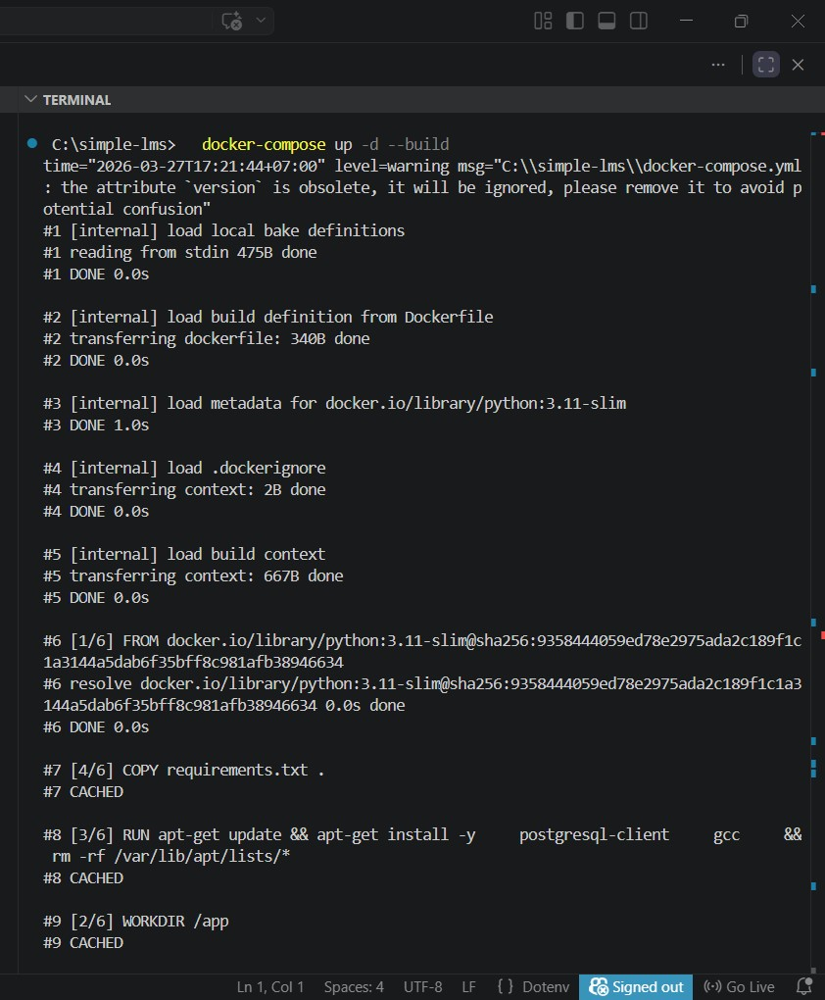

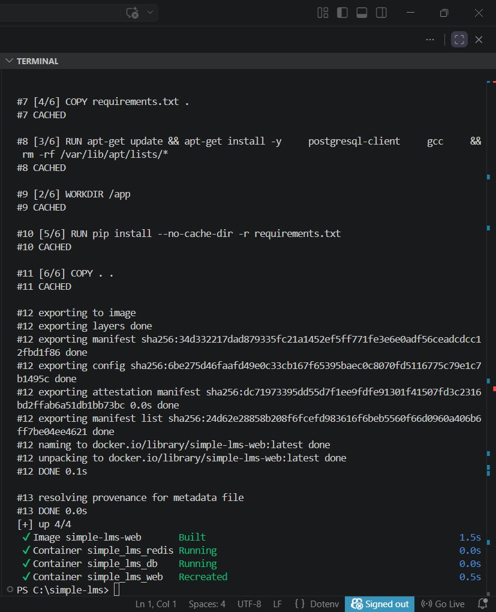

---

## 3. Jalankan Migration

```
docker-compose exec web python manage.py migrate
```

# Screenshot

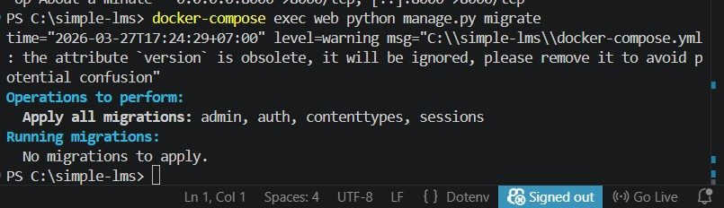

---

## 4. Buat Superuser

```
docker-compose exec web python manage.py createsuperuser
```

📸 Screenshot

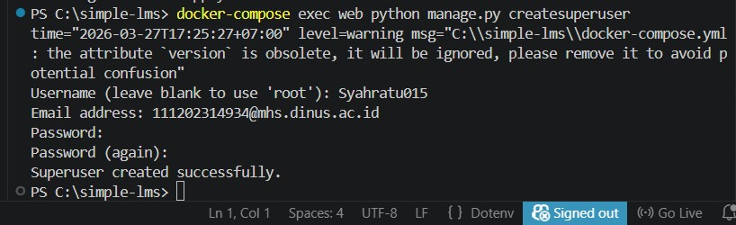

---

## 5. Cek Container Running

```
docker-compose ps
```

# Screenshot

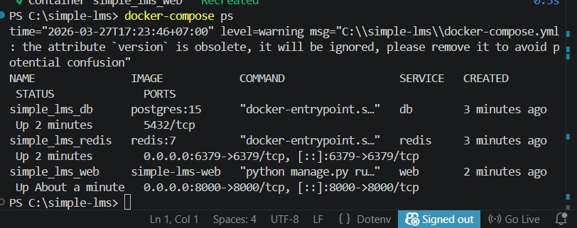

---

## 6. Akses Django

Buka browser

```
http://localhost:8000
```

# Screenshot

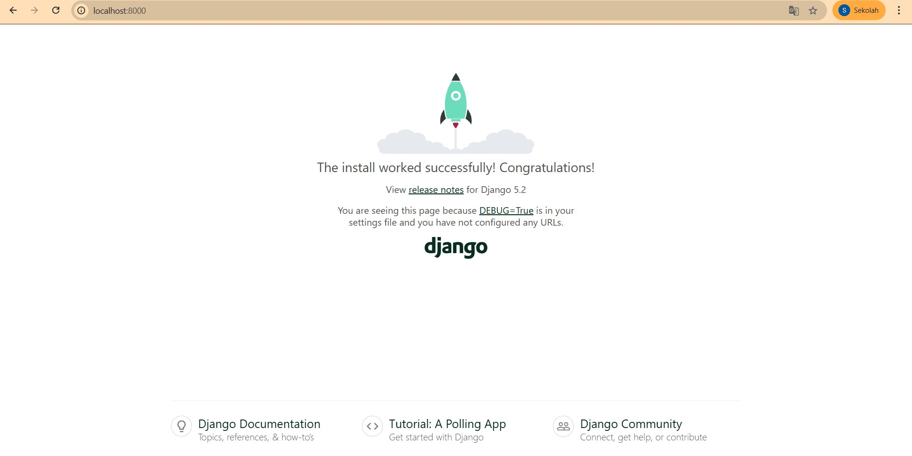

---

## 7. Django Admin

```
http://localhost:8000/admin
```

# Screenshot

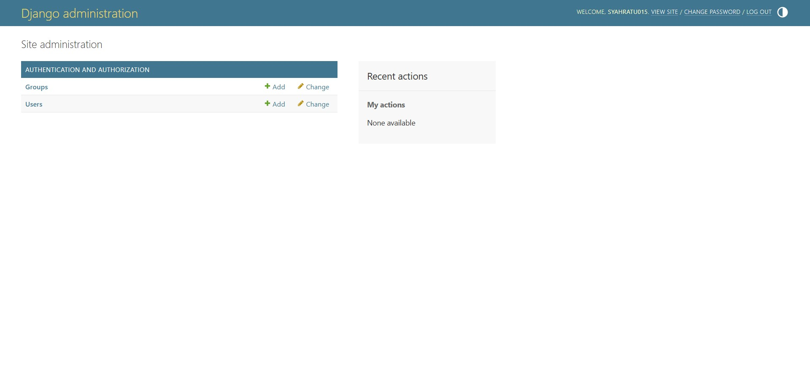

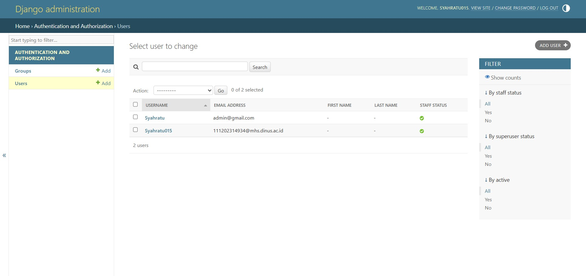

---

#  Environment Variables

File `.env.example`

```
DEBUG=True
SECRET_KEY=django-secret-key

POSTGRES_DB=simple_lms
POSTGRES_USER=postgres
POSTGRES_PASSWORD=postgres
POSTGRES_HOST=db
POSTGRES_PORT=5432
```

---

#  Project Structure

```
simple-lms/
├── docker-compose.yml
├── Dockerfile
├── .env.example
├── requirements.txt
├── manage.py
├── config/
│   ├── settings.py
│   ├── urls.py
│   └── wsgi.py
├── screenshoot/
└── README.md
```

---

#  Teknologi yang Digunakan

* Python 3.11
* Django
* PostgreSQL
* Redis
* Docker
* Docker Compose
* Visual Studio Code
* Windows

---


## PROGRESS 2

# 📚 Simple LMS - Progress 2  
## Database Design & ORM Implementation

## 📌 Deskripsi
Pada progress ini dilakukan perancangan database LMS menggunakan Django ORM, termasuk relasi antar model, optimasi query, dan penggunaan Django Admin.

---

# 🎯 Data Models

Model yang digunakan:
- User (admin, instructor, student)
- Category (hierarchy)
- Course
- Lesson
- Enrollment
- Progress

📸  
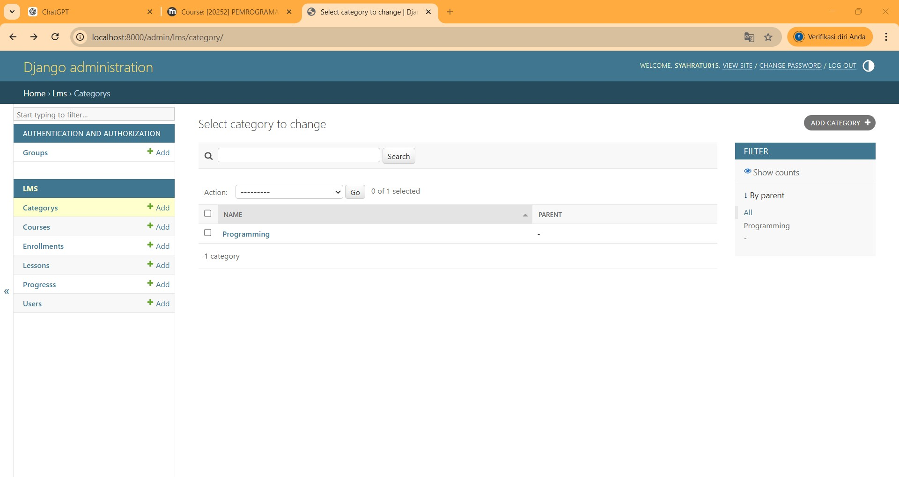

---

# 🔗 Tampilan Admin

## 🔹 Admin Dashboard
📸  
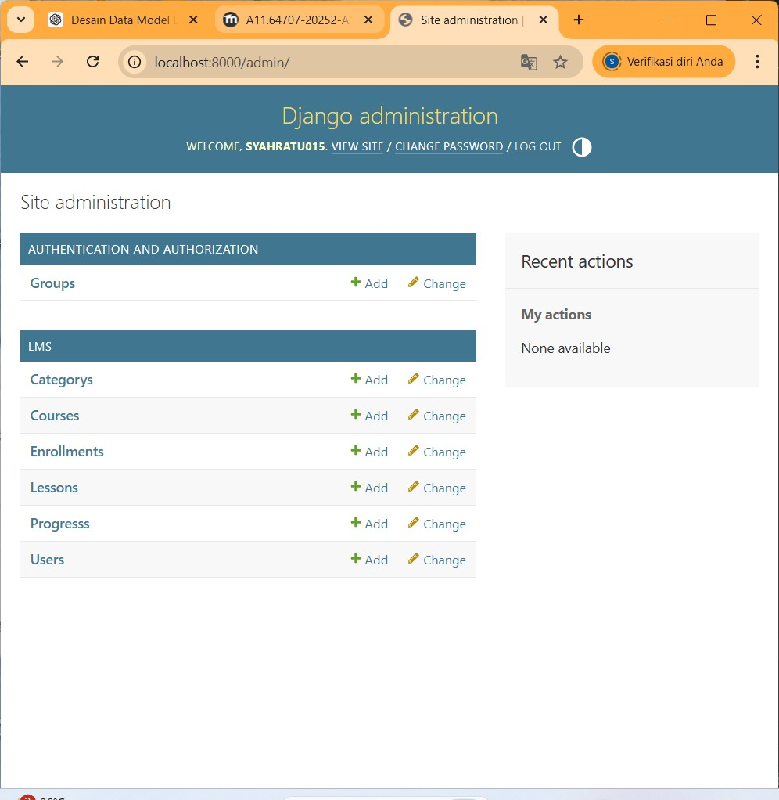

---

## 🔹 Course List
📸  


---

## 🔹 Detail Course
📸  
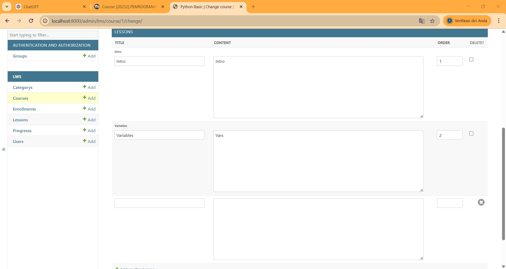

---

## 🔹 Lesson (Inline)
📸  
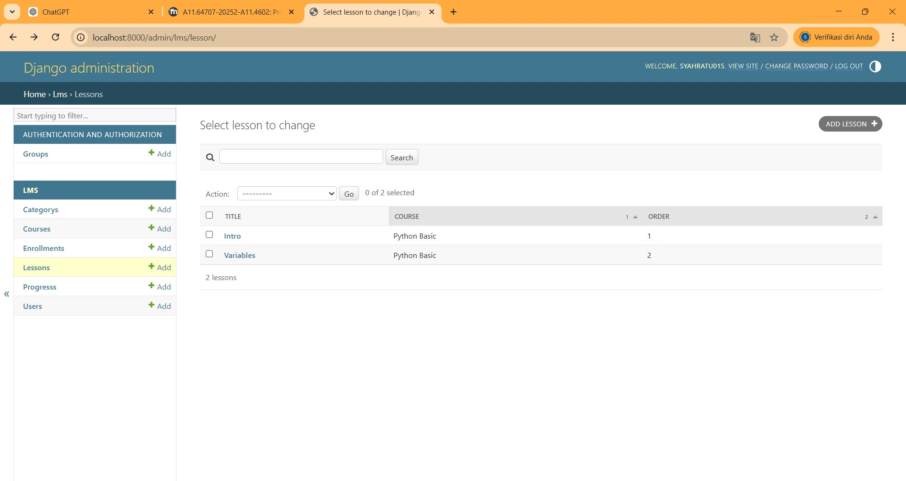

---

## 🔹 User Role
📸  
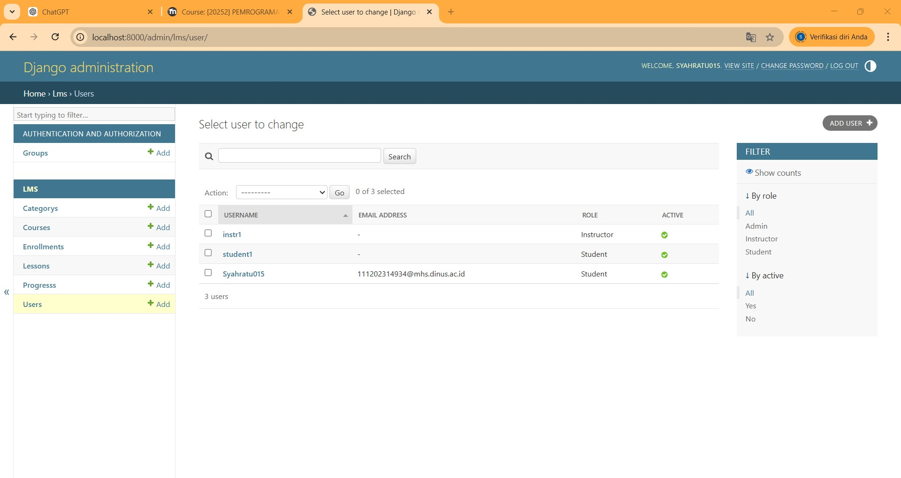

---

## 🔹 Enrollment
📸  


---

## 🔹 Progress
📸  
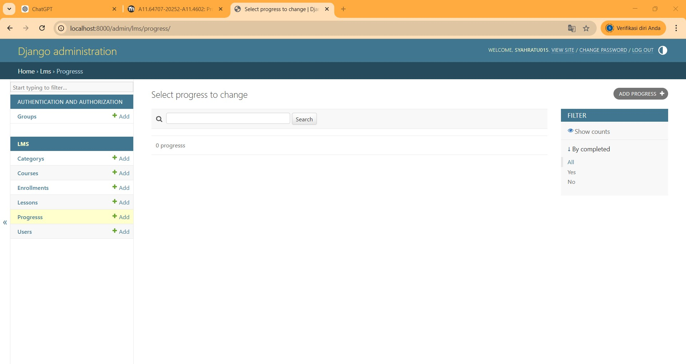

---

# ⚡ Query Optimization

```python
def for_listing(self):
    return self.select_related('instructor','category')\
               .prefetch_related('lessons')

def for_student_dashboard(self):
    return self.select_related('student','course')\
               .prefetch_related('progress','course__lessons')

# 👨 Author

Nama : Syahratu Andhara Satriani
NIM : A11.2023.14934
Project : Simple LMS Django Docker
Environment : Windows - Visual Studio Code
